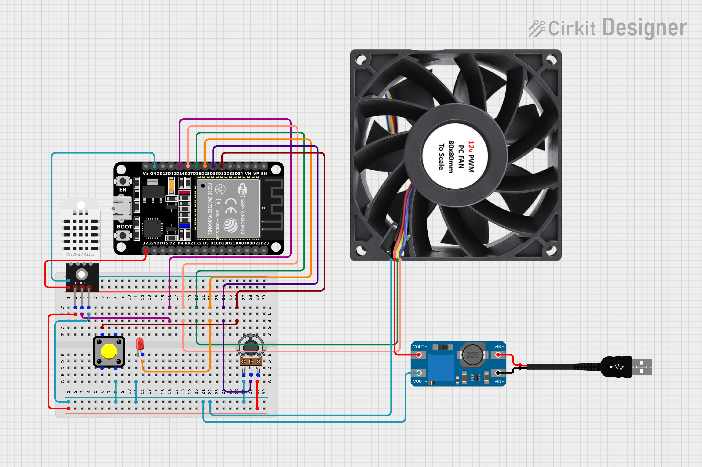

# ESP32 PWM Fan Controller

A self-hosted ESP32 firmware that adjusts PWM fan speed based on DHT22 temperature readings. Features a PID controller, web dashboard, MQTT telemetry, and a captive portal WiFi manager — no cloud dependency.

## Features

- **DHT22** temperature & humidity sensing
- **25 kHz PWM** fan control (4-pin computer fan standard)
- **Tachometer** RPM measurement with interrupt debounce
- **Two modes:** MANUAL (potentiometer or dashboard slider) and AUTO (PID or Linear ramp-up)
- **Manual PID** controller with anti-windup, no external library
- **Web dashboard** served from the ESP32 — HTTP polling, 4-column grid, history charts (60s Canvas 2D)
- **MQTT** publishes telemetry every 2s, subscribes to remote commands
- **Captive portal** WiFi manager — softAP always on, DNS spoofing, one-click network scan & connect
- **Admin status page** — password-gated system info, sensor/fan/WiFi/MQTT status, WiFi reconfiguration, restart with confirm
- **16x2 I2C LCD** — cycles between date/time (NTP), temp/humidity/RPM/speed, and IP/mode every 3 seconds
- **Physical button** to toggle MANUAL/AUTO, **LED indicator**

## Quick Start

### Example Wirings
[](assets/circuit_image.png)

### Hardware Setup

| GPIO | Connection |
|------|-----------|
| 14 | DHT22 DATA (4.7kΩ pull-up) |
| 21 | I2C SDA (LCD) |
| 22 | I2C SCL (LCD) |
| 25 | LED anode (via 220Ω) |
| 26 | Fan tachometer output (INPUT_PULLUP) |
| 27 | Fan PWM input (25 kHz) |
| 32 | Push button (to GND, INPUT_PULLUP) |
| 33 | 10kΩ Potentiometer wiper (0–4095) |

> [!NOTE]
> Depending on your setup, you might also need a Step-up/Down converter to power your fan if it requires a different voltage than the ESP32. On this project, I used an off-the-shelf 12V PWM PC fan and powered it with a standard 5V USB charger through an **MT3608 step-down converter**.

### Build & Flash

1. Install [PlatformIO](https://platformio.org/)
2. Copy `include/secrets.h.example` → `include/secrets.h`
3. Fill in your credentials
4. Connect the ESP32 via USB
5. Run:

```bash
pio run -t upload
pio device monitor
```

### First Boot

The ESP32 creates a softAP network for you to connect your ESP32 to the home network. Connect your device to this network — the captive portal page will appear automatically. Select your home WiFi and enter the password. The ESP32 saves the credentials and connects.

Once the ESP32 is connected to your home network, open `http://<esp-ip>/` for the dashboard. This IP address should be visible on the serial monitor or in the captive portal after connecting to your network.

> [!NOTE]
> You can also access the status page from the softAP's IP `http://192.168.4.1/status?pass=...` to view which IP address the ESP32 has obtained from your router. **Make sure to access this from the device that is connected to the softAP.**

## Dashboard

| Route | Description |
|-------|------------|
| `/` | Fan control dashboard (temp, humidity, speed, RPM, charts, controls) |
| `/status?pass=...` | (From softAP) Admin status page  |
| `/portal` | (From softAP) Captive portal WiFi setup page |

### API

| Method | Route | Auth | Description |
|--------|-------|------|-------------|
| GET | `/api/status` | — | JSON telemetry (temp, humidity, PWM, RPM, mode, etc.) |
| POST | `/api/cmd` | — | Send commands (`mode_auto`, `mode_manual`, `pwm`, `setpoint`, `automode`) |
| POST | `/api/portal/scan` | — | Scan WiFi networks |
| POST | `/api/portal/connect` | — | Save credentials & connect |
| GET | `/api/portal/status` | — | STA connection status |
| GET | `/api/wifi/status` | `?pass=` | WiFi details + saved SSID |
| POST | `/api/wifi/save` | adminPass | Save new WiFi credentials |
| POST | `/api/wifi/forget` | adminPass | Clear saved credentials |
| POST | `/api/system/restart` | adminPass | Restart ESP32 |

## Configuration

Edit `include/secrets.h`:

```cpp
const char* WIFI_SSID = "...";          // STA fallback SSID
const char* WIFI_PASS = "...";          // STA fallback password
const char* WIFI_AP_SSID = "...";       // SoftAP SSID
const char* WIFI_AP_PASS = "...";       // SoftAP password
const char* WIFI_ADMIN_PASS = "...";    // Admin pass, also used for /status?pass=... password
const char* MQTT_SERVER = "...";        // MQTT broker address
const int   MQTT_PORT = 1883;           // MQTT broker port (default 1883)
const char* MQTT_USER = "...";          // MQTT username
const char* MQTT_PASS = "...";          // MQTT password
```

## MQTT Topics

| Topic | Direction | Description |
|-------|-----------|-------------|
| `fan/telemetry` | PUB (2s) | Sensor & status JSON |
| `fan/status` | PUB (retained) | Online/offline |
| `fan/cmd` | SUB | Remote commands |

## Branches

```
main ── v1 ── v2 ── v2.1 ── v2.2 ── v2.3 ── v2.4
```

- **v1:** Pot-controlled PWM + DHT22 + auto/manual toggle
- **v2:** MQTT foundations (PubSubClient, ArduinoJson)
- **v2.1:** Web dashboard, PID controller, full MQTT integration
- **v2.2:** History charts (4 Canvas 2D, 60s rolling)
- **v2.3:** WiFi Manager captive portal + admin status page
- **v2.4:** 16x2 I2C LCD display with 3-screen cycle

## Documentation

Full project documentation is available in [`docs/PROJECT.md`](docs/PROJECT.md).
