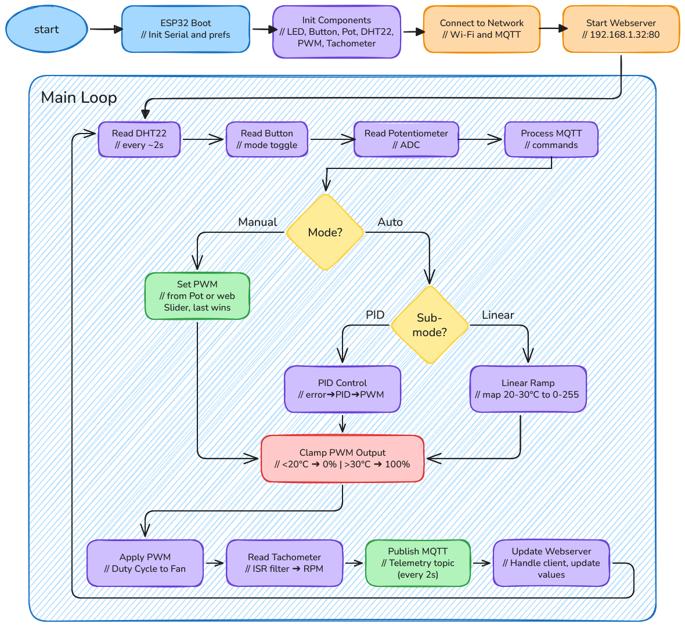

# ESP32 PWM Fan Controller

A self-hosted ESP32-based fan controller that adjusts PWM fan speed based on
DHT22 temperature readings. Features a PID controller with a web dashboard,
MQTT telemetry, and a captive portal WiFi manager — no cloud dependency.

---

## Features

- **DHT22 temperature & humidity sensor** read every loop iteration
- **PWM fan control** at 25 kHz (4-pin computer fan standard)
- **Tachometer RPM measurement** via interrupt with 2ms software debounce
- **Two operating modes:** MANUAL (potentiometer or dashboard slider) and AUTO
  (PID or Linear ramp-up)
- **PID controller** — manual implementation with anti-windup, no library
  dependency
- **Local web dashboard** served directly from the ESP32 — no WebSocket, pure
  HTTP polling
- **MQTT telemetry** publishes every 2s, subscribes to remote commands
- **History charts** for temperature, humidity, target RPM, and actual RPM
  (last 60 seconds, Canvas 2D)
- **Physical push button** to toggle MANUAL/AUTO mode
- **LED indicator** — ON in MANUAL, OFF in AUTO
- **WiFi Manager via captive portal** — softAP always on, DNS spoofing,
  one-click network scan & connect at `/portal`
- **Admin status page** — password-gated system info, sensor/fan/WiFi/MQTT
  status, API reference, WiFi reconfiguration, restart with confirm dialog
- **16x2 I2C LCD display** — cycles between date/time (NTP synced),
  temperature/humidity/RPM/speed, and IP/operating mode every 3 seconds

---

## Hardware Requirements

| Component | Purpose |
|---|---|
| ESP32 Dev Board (AZ-Delivery DevKit V4) | Main controller |
| DHT22 sensor | Temperature & humidity |
| 4-pin PWM computer fan | Controlled load |
| 10 kΩ potentiometer | Manual speed control |
| Push button (momentary, normally open) | Mode toggle |
| LED + 220 Ω resistor | Mode indicator |
| 16x2 I2C LCD (PCF8574 backpack) | Status display |
| 10 kΩ resistor (optional) | Tachometer pull-up if fan lacks internal pull-up |

### Pin Mapping

| GPIO | Connected To | Notes |
|---|---|---|
| 14 | DHT22 DATA | Requires 4.7 kΩ pull-up to 3.3V |
| 21 | I2C SDA (LCD) | Default I2C, no Wire.begin() needed |
| 22 | I2C SCL (LCD) | Default I2C, no Wire.begin() needed |
| 25 | LED anode (via resistor) | Active HIGH, ON = MANUAL |
| 26 | Fan tachometer output | INPUT_PULLUP, FALLING edge interrupt |
| 27 | Fan PWM input | 25 kHz, 8-bit resolution (0–255) |
| 32 | Push button (other leg to GND) | INPUT_PULLUP, active LOW |
| 33 | Potentiometer wiper | ADC input, 0–4095 |
| 3.3V | DHT22 VCC, pot high side, fan tach pull-up | |
| GND | Common ground | |
| VIN / 5V | Fan motor power (if 5V fan) | Do NOT power fan from 3.3V pin |
| GND (fan) | Fan ground | Must share ground with ESP32 |

---

## Architecture Overview

```
                    ┌──────────────────────────────────┐
                    │            ESP32                 │
                    │                                  │
 ┌──────┐   GPIO 14 │  ┌─────────┐   GPIO 27 ─────────►│──── PWM ──► Fan
 │DHT22 ├──────────►│  │ control │                     │
 └──────┘           │  │  loop   │   GPIO 26 ◄─────────│◄─── Tach ── Fan
                    │  │         │                     │
 ┌──────┐           │  │  loop() │   STA WiFi ────────►│──── MQTT broker
 |      |   GPIO 33 │  │         │   AP WiFi ─────────►│──── Device (captive portal)
 | Pot  ├──────────►│  │         │   DNSServer :53 ───►│──── DNS spoof
 │      │           |  |         |                     │       │
 └──────┘           │  │  ┌──────┤   WebServer :80 ───►│──── Browser
 ┌──────┐   GPIO 32 │  │  │ PID  │                     │       │
 │ Btn  ├──────────►│  │  │class │   GPIO 25 ─────────►│────  LED
 └──────┘           │  │  └──────┤                     │
                    │  └─────────┘                     │
                    └──────────────────────────────────┘
```

Three subsystems run concurrently in `loop()`:

1. **WiFi + MQTT** — maintains connection, pumps incoming messages, publishes
   telemetry every 2s
2. **WebServer** — handles HTTP requests (dashboard, status JSON, commands)
3. **Control loop** — reads sensors, computes fan speed, writes PWM, logs to
   serial

---
## Flowchart Diagram

[](../assets/esp32fan-flowchart-fin.excalidraw.png)

## Firmware Deep Dive (`src/main.cpp`)

### Pin Definitions & Globals

All pin assignments are constants at the top (lines 10–19):

```cpp
const int PWM_PIN = 27;
const int TACH_PIN = 26;
const int POT_PIN = 33;
const int DHT_PIN = 14;
const int BTN_PIN = 32;
const int LED_PIN = 25;
LiquidCrystal_I2C lcd(0x27, 16, 2);
```

Two enums control operating state:

```cpp
enum FanMode { MANUAL, AUTO };
FanMode fanMode = MANUAL;

enum AutoMode { PID_MODE, LINEAR_MODE };
AutoMode autoMode = PID_MODE;
```

- `fanMode` switches between MANUAL and AUTO (via button or remote command).
- `autoMode` selects the control algorithm within AUTO (PID vs. Linear ramp).

### Tachometer ISR (lines 37–43)

The fan's tachometer output produces two pulses per revolution. An interrupt
fires on every FALLING edge. A 2000 µs debounce filter rejects contact bounce
and noise:

```cpp
void IRAM_ATTR tachISR() {
  unsigned long now = micros();
  if (now - lastTachMicros > 2000) {
    tachPulseCount = tachPulseCount + 1;
    lastTachMicros = now;
  }
}
```

The ISR is attached in `setup()`:

```cpp
pinMode(TACH_PIN, INPUT_PULLUP);
attachInterrupt(digitalPinToInterrupt(TACH_PIN), tachISR, FALLING);
```

Every 1000 ms the pulse count is converted to RPM and reset:

```cpp
currentRPM = (tachPulseCount * 60000) / (TACH_SAMPLE_TIME * 2);
tachPulseCount = 0;
```

The formula accounts for 2 pulses/revolution and a 1000 ms sample window.

### Manual Mode: Input-Last-Wins with Hysteresis (lines 225–236)

In MANUAL mode, two inputs can control the fan: the physical potentiometer and
the dashboard slider. The rule is **input-last-wins** — whichever was touched
most recently takes over.

```cpp
if (manualPWMOverride >= 0) {
  fanSpeed = manualPWMOverride;
  if (abs(potValue - lastPotValue) > POT_HYSTERESIS) {
    manualPWMOverride = -1;    // release override
    fanSpeed = map(potValue, 0, 4095, 0, 255);
  }
} else {
  fanSpeed = map(potValue, 0, 4095, 0, 255);
}
lastPotValue = potValue;
```

- `manualPWMOverride` is set to a 0–255 value when the dashboard slider is
  dragged (via `POST /api/cmd {"cmd":"pwm","v":<percent>}`).
- While `manualPWMOverride >= 0`, the potentiometer is ignored **unless** it
  moves by ≥50 ADC counts (`POT_HYSTERESIS`). A large enough pot movement
  clears the override and returns control to the potentiometer.

This prevents the pot from fighting the slider while still allowing the user to
physically override the slider by turning the knob decisively.

### AUTO Mode: PID vs Linear (lines 207–224)

```cpp
if (fanMode == AUTO) {
  if (dhtValid) {
    if (autoMode == LINEAR_MODE) {
      fanSpeed = constrain(map((int)(temp * 10), 200, 300, 0, 255), 0, 255);
    } else {
      pidInput = temp;
      pid.Compute();
      if (temp < 20.0) {
        fanSpeed = 0;
      } else if (temp > 30.0) {
        fanSpeed = 255;
      } else {
        fanSpeed = constrain((int)pidOutput, 0, 255);
      }
    }
  } else {
    fanSpeed = 0;   // DHT error → fan off
  }
}
```

**Linear mode** maps temperature 20.0–30.0°C linearly to PWM 0–255. Below 20°C
the fan is off; above 30°C it runs at full speed. This is a simple thermostat
curve with no setpoint.

**PID mode** uses the setpoint (default 24.0°C, adjustable ±0.5°C steps via
dashboard). The `PID::Compute()` method calculates the output, then the same
20/30°C hard limits are applied as safety bounds.

### PID Controller: Manual Implementation (lines 56–106)

No external library. The `PID` class implements a positional PID algorithm:

```cpp
void Compute() {
  if (!enabled) return;
  unsigned long now = millis();
  if (now - lastTime < sampleTime) return;   // 2000 ms gate
  double dt = (double)(now - lastTime) / 1000.0;
  lastTime = now;

  double error = *input - *setpoint;         // cooling: positive error → faster
  double P = Kp * error;

  integral += error * dt;
  if (integral > 500) integral = 500;        // ±500 clamp
  if (integral < -500) integral = -500;
  double I = Ki * integral;

  double D = Kd * (error - lastError) / dt;
  lastError = error;

  double out = P + I + D;
  if (out > outMax) { out = outMax; integral -= error * dt; }   // anti-windup
  if (out < outMin) { out = outMin; integral -= error * dt; }   // anti-windup
  *output = out;
}
```

Key design decisions:

- **`error = input - setpoint`** — Positive error (temperature above setpoint)
  produces a positive output → higher fan speed. This is intuitive for cooling
  applications.
- **Sample time gate** — `Compute()` does nothing until at least 2000 ms have
  elapsed since the last computation. This keeps `dt` consistent and prevents
  windup from rapid calls.
- **Conditional integration (anti-windup)** — When the output saturates at
  `outMin` or `outMax`, the error accumulated during that sample is subtracted
  from the integral term. This prevents the integrator from "winding up" while
  the actuator is already at its limit.
- **Integral ±500 clamp** — A secondary safety bound on the integral term
  prevents excessive buildup even if the output never saturates.
- **No derivative kick** — The derivative is computed on `error`, not on
  `input`. This means a step change in setpoint will cause a spike in the D
  term. For this application (slow thermal dynamics) it is acceptable.

Parameters (defined at line 54):

| Param | Value | Effect |
|---|---|---|
| Kp | 30.0 | Proportional gain — how aggressively fan responds to current error |
| Ki | 0.5 | Integral gain — how much past error accumulates |
| Kd | 8.0 | Derivative gain — dampens response to rapid temperature changes |

### AP+STA Mode (lines 149–156)

The ESP32 runs in dual mode — softAP is always on for captive portal access,
while STA connects to the user's home network:

```cpp
WiFi.mode(WIFI_AP_STA);
WiFi.setHostname("esp32-fan");
WiFi.softAP(WIFI_AP_SSID, WIFI_AP_PASS);      // "ESP32-Fan-A1NP" / "gantengonly420"
dnsServer.start(53, "*", WiFi.softAPIP());     // catch all DNS → AP IP
```

- **AP:** SSID `ESP32-Fan-A1NP`, password `gantengonly420`. Always available.
- **DNSServer:** Resolves every domain to `192.168.4.1` so phones see the
  captive portal page when they connect to the AP.
- **STA:** Connects to the user's WiFi using NVS-stored credentials (or
  `secrets.h` fallback).

### WiFi Credential Priority

The device checks credentials in this order:

1. **NVS (Preferences)** — SSID/password saved via the captive portal or
   status page. Survives reboots.
2. **`secrets.h`** — Compile-time fallback in `include/secrets.h`.
3. **Offline** — If neither is available, STA stays disconnected. The AP and
   dashboard still work.

Helper functions (file bottom) manage NVS storage:

```cpp
String getSavedSSID() {
  preferences.begin("wifi", true);
  String val = preferences.getString("ssid", "");
  preferences.end();
  return val;
}
void saveCredentials(const String& ssid, const String& pass) { ... }
void clearCredentials() { ... }
```

### STA Connection (lines 289–315)

```cpp
void connectWiFi() {
  lastWifiAttempt = millis();
  wifiConnected = false;
  String ssid = getSavedSSID();
  String pass = getSavedPass();
  if (ssid.length() == 0) {
    ssid = WIFI_SSID;
    pass = WIFI_PASS;
  }
  if (ssid.length() == 0 || ssid == "your_ssid") {
    Serial.println("No valid WiFi credentials (offline mode)");
    return;
  }
  Serial.print("Connecting to WiFi");
  WiFi.begin(ssid.c_str(), pass.c_str());
  int timeout = 100;   // 10 seconds
  while (WiFi.status() != WL_CONNECTED && timeout > 0) {
    delay(100);
    Serial.print(".");
    timeout--;
  }
  // ...
}
```

- Blocking call with 10-second timeout. If WiFi fails, the device continues in
  **offline mode** — the fan still works, the dashboard is still served over
  the local network (once WiFi connects), but MQTT is unavailable.
- Retries every 30 seconds in `loop()`.
- The `wifiConnected` flag triggers a one-time IP address print on successful
  connect.

### MQTT (lines 310–336)

**Last Will & Testament:** On connect, the device publishes a retained message:

```cpp
mqtt.connect(clientId.c_str(), MQTT_USER, MQTT_PASS, "fan/status", 0, true, "{\"online\":0}")
```

If the device disconnects unexpectedly, the broker automatically publishes
`{"online":0}` to `fan/status` so consumers know the device went offline.

On successful connect, it publishes online status and subscribes to commands:

```cpp
mqtt.publish("fan/status", "{\"online\":1}", true);
mqtt.subscribe("fan/cmd");
```

Telemetry is published every 2 seconds (non-retained):

```cpp
void publishTelemetry() {
  if (!mqtt.connected()) return;
  String json = buildStatusJSON();
  mqtt.publish("fan/telemetry", json.c_str(), false);
}
```

### Web Server (lines 362–374)

The web server uses the built-in `WebServer.h` library (part of the ESP32
Arduino Core). No external dependencies. HTTP polling is used instead of
WebSockets because `ESPAsyncWebServer` is incompatible with the lwIP stack
in ESP32 Core 3.x.

All routes registered in `setup()`:

| Route | Method | Handler | Auth | Description |
|---|---|---|---|---|
| `/` | GET | `handleRoot` | — | Dashboard HTML from PROGMEM |
| `/api/status` | GET | `handleStatus` | — | JSON with all current values |
| `/api/cmd` | POST | `handleCommand` | — | Accepts JSON command, returns `{"ok":1}` |
| `/portal` | GET | `handlePortal` | — | Captive portal page (scan + connect WiFi) |
| `/status` | GET | `handleStatusPage` | `?pass=` | Admin status page (system info, config, restart) |
| `/api/portal/scan` | POST | `handlePortalScan` | — | Scan WiFi networks, return JSON list |
| `/api/portal/connect` | POST | `handlePortalConnect` | — | Save credentials + connect to network |
| `/api/portal/status` | GET | `handlePortalStatus` | — | Current STA connection status |
| `/api/wifi/status` | GET | `handleWifiStatus` | `?pass=` | Full WiFi status with saved SSID |
| `/api/wifi/save` | POST | `handleWifiSave` | adminPass | Save new credentials + reconnect |
| `/api/wifi/forget` | POST | `handleWifiForget` | adminPass | Clear NVS credentials, disable STA |
| `/api/system/restart` | POST | `handleSystemRestart` | adminPass | Restart ESP32 with `ESP.restart()` |

**Captive portal flow:** `onNotFound` catches any unregistered route (e.g.
`http://captive.apple.com/hotspot-detect.html`) and issues a 302 redirect to
`/portal`. Combined with DNSServer, this provides a complete captive portal
experience.

### Command Processing (lines 376–424)

All commands (from MQTT and HTTP) are routed through `processCommand()`. The
JSON is parsed with ArduinoJson 7:

```cpp
void processCommand(const char* json) {
  JsonDocument doc;
  DeserializationError err = deserializeJson(doc, json);
  if (err) return;

  const char* cmd = doc["cmd"];
  // ... dispatch on cmd ...
}
```

Accepted commands:

| `cmd` | `v` | Effect |
|---|---|---|
| `mode_auto` | — | Switch to AUTO mode, LED off |
| `mode_manual` | — | Switch to MANUAL mode, LED on |
| `pwm` | 0–100 | Set manual fan speed (only in MANUAL) |
| `setpoint` | 20.0–30.0 | Change PID setpoint in 0.5°C steps |
| `automode` | `"pid"` or `"linear"` | Switch AUTO sub-mode |

### Status JSON Format (lines 338–360)

Returned by `GET /api/status` and published to `fan/telemetry`:

```json
{
  "t":  25.3,     // Temperature (°C), -1 if sensor error
  "h":  62.1,     // Humidity (%), -1 if sensor error
  "p":  128,      // PWM duty (0–255)
  "s":  50,       // Speed percent (0–100)
  "r":  2450,     // Actual RPM
  "m":  1,        // Mode: 0=MANUAL, 1=AUTO
  "mq": 1,        // MQTT connected: 0 or 1
  "sp": 24.0,     // Setpoint (°C)
  "pid": 127,     // Raw PID output
  "am": 0,        // Auto sub-mode: 0=PID, 1=Linear
  "ut": 3600,     // Uptime (seconds since boot)
  "fh": 472000    // Free heap (bytes)
}
```

### LED Indicator

The LED on GPIO 25 provides a visual status:

```cpp
digitalWrite(LED_PIN, fanMode == MANUAL ? HIGH : LOW);
```

- **ON (HIGH)** — MANUAL mode (you are in direct control)
- **OFF (LOW)** — AUTO mode (the controller runs the fan)

### 16x2 I2C LCD Display

A 16×2 character LCD with PCF8574 I2C backpack is connected at address `0x27`
on the default I2C bus (GPIO 21 SDA, GPIO 22 SCL). It cycles through three
screens every 3 seconds:

| Screen | Line 1 | Line 2 |
|--------|--------|--------|
| 0 | `Date: DD/MM/YY` | `Time: HH:MM:SS` |
| 1 | `T:XX.XC   H:XX%` | `RPM:XXXX SPD:XX%` |
| 2 | `IP: x.x.x.x` | `Mode:AUTO PID   ` / `AUTO LINEAR` / `MANUAL   ` |

**NTP time sync** — `configTime(28800, 0, "pool.ntp.org", "time.nist.gov")`
is called once in `setup()` after WiFi connects. The LCD reads time via
`getLocalTime()` with a 2000 ms timeout. If NTP hasn't synced yet, the screen
shows `--/--/--` and `--:--:--` placeholders.

```cpp
void updateLCD(float temp, float humid, int fanSpeed) {
  unsigned long now = millis();
  if (now - lastLcdUpdate < 3000) return;
  lastLcdUpdate = now;

  struct tm tm;
  bool timeValid = getLocalTime(&tm, 2000);

  lcd.clear();
  lcd.setCursor(0, 0);

  switch (lcdScreen) {
    case 0:  // Date & Time
    case 1:  // Temp, Humidity, RPM, Speed
    case 2:  // IP & Mode
  }

  lcdScreen = (lcdScreen + 1) % 3;
}
```

- Mode text is padded to 11 characters to clear leftover characters when
  switching between modes (e.g. `AUTO LINEAR` → `AUTO PID   `).
- `lcd.clear()` + `lcd.setCursor()` avoids flicker at the 3s interval.
- The function is called every `loop()` iteration but only redraws when the
  3-second gate fires.

### Button Debounce (lines 188–196)

```cpp
bool btnState = digitalRead(BTN_PIN);
if (btnState == LOW && lastBtnState == HIGH && millis() - lastDebounceTime > DEBOUNCE_DELAY) {
  fanMode = (fanMode == MANUAL) ? AUTO : MANUAL;
  lastDebounceTime = millis();
  publishTelemetry();
}
lastBtnState = btnState;
```

Standard 50 ms debounce on the falling edge. Toggling immediately publishes a
telemetry update so MQTT consumers and the dashboard see the new mode.

---

## Web Dashboard (`include/dashboard.h`)

The dashboard is a single HTML page embedded in PROGMEM as a raw string
literal. It is served at the root `/` route.

### Layout (4-column grid)

```
┌──────────┬──────────┬──────────┬──────────┐
│  Temp    │ Humidity │ Fan Spd  │   RPM    │
├──────────┴──────────┼──────────┴──────────┤
│  MODE               │ CONTROL MODE        │
│  [AUTO] [MANUAL]    │  [PID] [Linear]     │
├─────────────────────┴─────────────────────┤
│  Target Temperature  ──●────── [+]/[-]    │
├───────────────────────────────────────────┤
│  Manual Speed        ──●──────            │
├───────────────────────────────────────────┤
│  History (last 60s)                       │
│  ┌─ Temperature ──────── (orange line)    │
│  ┌─ Humidity ────────── (blue line)       │
│  ┌─ Target RPM ──────── (purple dashed)   │
│  ┌─ Actual RPM ──────── (green solid)     │
└───────────────────────────────────────────┘
```

### CSS

Dark theme with a dark background (`#0f1117`), cards (`#1c1e26`) with subtle
borders (`#2d303a`), and a color-coded system:

| Element | Color | Hex |
|---|---|---|
| Temperature | Orange | `#f0883e` |
| Humidity | Blue | `#58a6ff` |
| PWM / Target RPM | Purple | `#a371f7` |
| RPM / Actual RPM | Green | `#3fb950` |

Utility classes:
- `.greyed` — sets `opacity:0.4; pointer-events:none` to disable a card
- `.mode-btn` — larger buttons for mode selection (1rem, 10px 24px padding)

### Greyed State Machine

The dashboard disables irrelevant controls based on the current mode:

| State | Control Mode | Target Temp | Manual Slider |
|---|---|---|---|
| MANUAL | greyed | greyed | enabled |
| AUTO+PID | enabled | enabled | disabled |
| AUTO+Linear | enabled | greyed | disabled |

This is evaluated every poll cycle (line 173–177):

```js
document.getElementById('ctrlModeCard').className = currentMode ? 'card' : 'card greyed';
document.getElementById('spCard').className = (currentMode && currentAutoMode === 0) ? 'card' : 'card greyed';
document.getElementById('pwmSlider').disabled = currentMode ? true : false;
```

### JavaScript Architecture

**Polling loop** (`updateDash`): Fetches `/api/status` every 1000 ms via
`setInterval`. On each response it updates all DOM elements and re-draws the
charts. On fetch error, the Dashboard indicator turns red.

**History arrays** (60 samples, 1 per second):

```js
var histTemp = [], histHumid = [], histTargetRpm = [], histActualRpm = [];
```

On each poll, valid readings are pushed. If a sensor reading is invalid, `null`
is pushed instead (the chart drawing function skips nulls, creating gaps in the
line).

```js
if (d.t >= 0) { histTemp.push(d.t); histHumid.push(d.h); }
else          { histTemp.push(null); histHumid.push(null); }
// Trim to 60
while (histTemp.length > 60) histTemp.shift();
```

**Chart rendering** (`drawChart`): Uses the Canvas 2D API with
`devicePixelRatio` scaling for sharp output on HiDPI screens.

```js
function drawChart(id, data, yMin, yMax, color, lw, dash) {
  var c = document.getElementById(id);
  var rect = c.getBoundingClientRect();
  var dpr = window.devicePixelRatio || 1;
  c.width = rect.width * dpr;
  c.height = rect.height * dpr;
  var ctx = c.getContext('2d');
  ctx.scale(dpr, dpr);
  // ... grid, axes, line drawing ...
}
```

Each chart has:
- 5 horizontal grid lines (0%, 25%, 50%, 75%, 100% of Y range)
- Y-axis labels (right-aligned, monospace)
- X-axis countdown labels (`-60s` to `-0s`)
- A single colored line (solid or dashed)

**Event handlers** for all controls use `POST /api/cmd`:
- `spDown`/`spUp` — adjust setpoint by ±0.5°C
- `spSlider` (range input) — drag to set setpoint, sends on `onchange` (not
  `oninput`) to avoid flooding
- `modeAuto`/`modeManual` — switch operating mode
- `modePid`/`modeLinear` — switch AUTO sub-mode
- `pwmSlider` — `oninput` updates display locally, `onchange` sends to ESP

---

## Captive Portal (`include/portal.h`, `src/main.cpp`)

The ESP32 provides a complete captive portal experience for first-time WiFi
setup. It is served both via DNS spoofing (when a phone connects to the AP)
and directly at `/portal`.

### DNS & Redirect Setup (lines 148–156)

```cpp
WiFi.mode(WIFI_AP_STA);
WiFi.softAP(WIFI_AP_SSID, WIFI_AP_PASS);
dnsServer.start(53, "*", apIP);
// ...
server.onNotFound([]() {
  server.sendHeader("Location", "/portal", true);
  server.send(302, "text/plain", "");
});
```

When a client connects to the AP and tries to visit any website:
1. DNS lookup hits the ESP32's DNSServer → resolves to `192.168.4.1`
2. HTTP request arrives at the ESP32 → `onNotFound` catches it
3. 302 redirect to `http://192.168.4.1/portal`
4. Phone browser displays the captive portal page

### Portal Page (`GET /portal`)

The portal HTML (`PORTAL_HTML`) is served from PROGMEM. It provides:

- **Auto-scan** — On page load, calls `POST /api/portal/scan` to list nearby
  networks with signal strength bars and lock icons.
- **Select & Connect** — User taps a network, enters password (if secured),
  clicks Connect. JS sends `POST /api/portal/connect` with `{ssid, pass}`.
- **Poll & Redirect** — Polls `GET /api/portal/status` every 1s. On success,
  shows the ESP's LAN IP and redirects to `http://google.com` (triggers captive
  portal completion on iOS/Android).

### Portal API Endpoints

| Route | Method | Description |
|---|---|---|
| `/api/portal/scan` | POST | Scan WiFi networks, return JSON `{networks: [{ssid, rssi, secured}]}` |
| `/api/portal/connect` | POST | Save credentials to NVS, begin STA connect `{ssid, pass}` |
| `/api/portal/status` | GET | Return `{connected, ssid, ip}` for portal polling |

### Admin Status Page (`GET /status?pass=...`)

The status page (`STATUS_HTML`) provides a comprehensive system overview gated
behind `WIFI_ADMIN_PASS`:

- **Uptime card** — Formatted uptime (e.g. `2d 03h 15m 42s`)
- **Status cards** — WiFi, MQTT, DHT22, Fan mode with colored dots
- **WiFi Details** — STA SSID/IP/signal, saved SSID, AP credentials, free heap
- **Sensor & Fan** — Temperature, humidity, speed, RPM, setpoint, PID output
- **MQTT Configuration** — Server, port, user, password (from `secrets.h`),
  and a topic reference (PUB `fan/telemetry`, PUB `fan/status`, SUB `fan/cmd`)
- **WiFi Configuration** — SSID/password form with Save & Reconnect and
  Forget WiFi buttons (both admin-gated)
- **Restart Button** — Large red button with JS `confirm()` dialog before
  `POST /api/system/restart`
- **API Reference** — Complete list of all endpoints with methods

The page fetches data from `/api/status` (every 3s) and `/api/wifi/status`
(every 5s) and updates all sections dynamically.

### Admin API Endpoints

| Route | Method | Auth | Description |
|---|---|---|---|
| `/api/wifi/status` | GET | `?pass=` | Full WiFi status + saved SSID + signal |
| `/api/wifi/save` | POST | `adminPass` in body | Save new credentials & reconnect |
| `/api/wifi/forget` | POST | `adminPass` in body | Clear NVS, disable STA |
| `/api/system/restart` | POST | `adminPass` in body | `ESP.restart()` after 500ms delay |

---

## MQTT Protocol Reference

### Publish Topics

| Topic | Retained | Interval | Payload |
|---|---|---|---|
| `fan/status` | Yes | On connect/disconnect | `{"online":1}` or `{"online":0}` |
| `fan/telemetry` | No | Every 2000 ms | Full status JSON (see §Status JSON) |

### Subscribe Topics

| Topic | QOS | Purpose |
|---|---|---|
| `fan/cmd` | 0 | Receive remote commands |

### Accepted Commands

All commands use the same JSON structure: `{"cmd":"<command>", "v":<value>}`.

```json
{"cmd":"mode_auto"}
{"cmd":"mode_manual"}
{"cmd":"pwm","v":75}
{"cmd":"setpoint","v":24.5}
{"cmd":"automode","v":"pid"}
{"cmd":"automode","v":"linear"}
```

---

## Configuration

### `secrets.h` (gitignored)

Copy `include/secrets.h.example` to `include/secrets.h` and fill in your
credentials:

```cpp
#pragma once

const char* WIFI_SSID = "your_ssid";          // STA fallback SSID
const char* WIFI_PASS = "your_password";      // STA fallback password

const char* WIFI_AP_SSID = "ESP32-Fan-A1NP";  // SoftAP SSID (always on)
const char* WIFI_AP_PASS = "gantengonly420";  // SoftAP password
const char* WIFI_ADMIN_PASS = "gantengonly420"; // /status page password

const char* MQTT_SERVER = "192.168.1.100";
const int   MQTT_PORT = 1883;
const char* MQTT_USER = "your_user";
const char* MQTT_PASS = "your_password";
```

- `WIFI_SSID`/`WIFI_PASS` are only used if no credentials are saved in NVS.
- `WIFI_AP_SSID`/`WIFI_AP_PASS` are the always-on softAP credentials.
- `WIFI_ADMIN_PASS` gates the `/status` admin page and all privileged API
  endpoints (wifi save/forget, system restart).
- `secrets.h` is listed in `.gitignore` and will not be committed.

### `platformio.ini`

```ini
[env:az-delivery-devkit-v4]
platform = https://github.com/pioarduino/platform-espressif32.git
board = az-delivery-devkit-v4
framework = arduino
upload_port = COM3
monitor_port = COM3
upload_speed = 115200
monitor_speed = 115200
lib_deps =
    adafruit/Adafruit Unified Sensor@^1.1.15
    adafruit/DHT sensor library@^1.4.7
    gyverlibs/Tachometer@^1.3
    knolleary/PubSubClient@^2.8
    bblanchon/ArduinoJson@^7.2.2
    marcoschwartz/LiquidCrystal_I2C@^1.1.4
```

Note: `br3ttb/ArduinoPID` is intentionally omitted — the PID controller is
implemented manually in `main.cpp`. The `gyverlibs/Tachometer` library is
included but unused (the tachometer is also implemented manually); it can be
removed to save flash space. `marcoschwartz/LiquidCrystal_I2C` drives the
16x2 character LCD over I2C.

---

## Tuning Guide

The PID parameters in `main.cpp:54` affect how the controller responds to
temperature changes.

| Parameter | Effect |
|---|---|
| **Kp** (proportional) | How strongly the fan responds to the current temperature error. Too high → oscillation. Too low → sluggish response. |
| **Ki** (integral) | How much past error accumulates. Eliminates steady-state error (fan never reaches exactly the right speed without it). Too high → overshoot and oscillation. |
| **Kd** (derivative) | Dampens the response to rapid changes. Helps prevent overshoot when temperature spikes suddenly. Too high → jittery, noise amplification. |

**Starting values:** Kp=30, Ki=0.5, Kd=8, sample time 2000 ms.

**Tuning approach:**

1. Set Ki=0, Kd=0. Increase Kp until the fan speed oscillates around the
   setpoint. Note the Kp value where oscillation begins (ultimate gain Ku).
2. Reduce Kp by ~40%.
3. Increase Ki gradually until steady-state error is eliminated (temperature
   settles exactly at setpoint).
4. Add a small amount of Kd if the system overshoots when temperature changes
   rapidly.

**Safety bounds** (hard-coded in `loop()`):
- Temperature < 20.0°C → fan off (regardless of PID output)
- Temperature > 30.0°C → fan full speed (regardless of PID output)
- PID output clamped 0–255 at all times

These bounds override the PID and prevent unsafe conditions regardless of
tuning.

---

## Serial Monitor Output

Every 1000 ms, the firmware prints a status line:

```
[AUTO PID] Set: 24.0C | Temp: 25.3C | PWM: 128 | Speed: 50% | Target: 2500 RPM | Actual: 2450 RPM | Humidity: 62.1%
[MANUAL] Pot: 2048 | PWM: 128 | Speed: 50% | Target: 2500 RPM | Actual: 2450 RPM | Humidity: 62.1%
[AUTO LIN] Set: 24.0C | Temp: 25.3C | PWM: 88 | Speed: 35% | Target: 1750 RPM | Actual: 1700 RPM | Humidity: 62.1%
```

---

## Git Branches

```
main ── v1: Pot-controlled PWM fan with DHT22 read + auto/manual toggle
  │
  v2: Added MQTT foundations (PubSubClient, ArduinoJson)
  │
  v2.1: Full MQTT + Web Dashboard + manual PID controller + UX improvements
  │       - WiFi, MQTT, WebServer all integrated
  │       - PID class (no library dependency)
  │       - Dashboard served from ESP32
  │       - PID/Linear toggle, greyed logic, layout restructure
  │
  v2.2: History charts for temp, humidity, target RPM, actual RPM
          - 4 Canvas 2D charts, 60s rolling window
          - DPR-aware rendering
          - Chart card placement and styling fixes
  │
  v2.3: WiFi Manager captive portal + admin status page
          - AP+STA mode with always-on softAP (ESP32-Fan-A1NP)
          - DNSServer for captive portal DNS spoofing
          - /portal page: scan networks, select SSID, connect
          - Preferences (NVS) for WiFi credential storage
          - /status page: system info, WiFi/MQTT/sensor status,
            API reference, WiFi reconfig, restart with confirm
          - 10 new HTTP routes for portal, wifi, and system mgmt
          - onNotFound → 302 redirect to /portal
          - MQTT Configuration card showing server details + topics
  │
  v2.4: 16x2 I2C LCD display with 3-screen cycle
          - LCD on GPIO 21 (SDA) / 22 (SCL), address 0x27
          - Screen 0: Date/time via NTP (GMT+8)
          - Screen 1: Temperature, humidity, RPM, speed %
          - Screen 2: IP address and operating mode
          - 3-second auto-cycle between screens
```

Current active branch: `v2.4`.

---

## Appendix: Complete Loop Walkthrough

A single iteration of `loop()` (approximately 50 ms due to `delay(50)` at
the end):

1. **WiFi check** (line 167) — If disconnected and >30s since last attempt,
   call `connectWiFi()`.

2. **MQTT loop** (line 183) — If WiFi is connected, pump the MQTT client.
   If MQTT disconnected, attempt reconnect.

 3. **DNS server** — `dnsServer.processNextRequest()` resolves captive portal
    DNS lookups (any domain → AP IP 192.168.4.1).

 4. **HTTP server** — `server.handleClient()` processes one pending
    HTTP request (dashboard page, status poll, portal/status page, or command POST).

 5. **Button debounce** (lines 188–196) — Read GPIO 32. If falling edge
   detected and >50ms since last press, toggle `fanMode`.

 6. **Set LED** (line 198) — Reflect current mode on GPIO 25.

 7. **Read DHT22** (lines 200–202) — Read temperature and humidity. Check for
   `isnan()` (sensor error).

 8. **Read potentiometer** (line 205) — `analogRead(GPIO 33)` returns 0–4095.

 9. **Compute fan speed** (lines 207–236):
   - AUTO: If DHT valid, run PID or linear calculation. Apply 20/30°C bounds.
   - MANUAL: Use `manualPWMOverride` (if set by dashboard slider) or map pot
     value. Apply hysteresis to release override.

 10. **Write PWM** (line 238) — `ledcWrite(PWM_PIN, fanSpeed)`.

 11. **Tachometer sample** (lines 243–279) — Every 1000 ms, calculate RPM,
     print serial status line, reset pulse counter.

 12. **LCD update** — Call `updateLCD()`. Only redraws if 3-second gate has
     elapsed. Cycles through date/time, sensors, and IP/mode screens.

 13. **MQTT publish** (lines 281–284) — Every 2000 ms, publish telemetry JSON
     to `fan/telemetry`.

 14. **Delay** (line 286) — `delay(50)` yields to the RTOS scheduler.

Total loop iteration time: ~50–55 ms (dominated by `delay(50)`).
